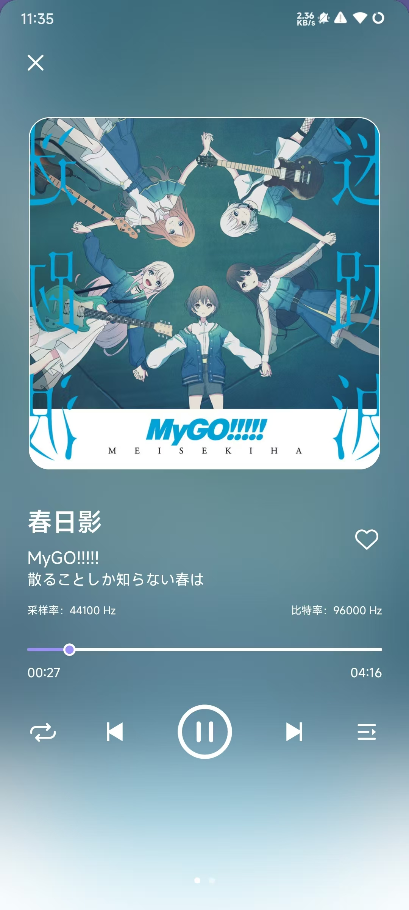
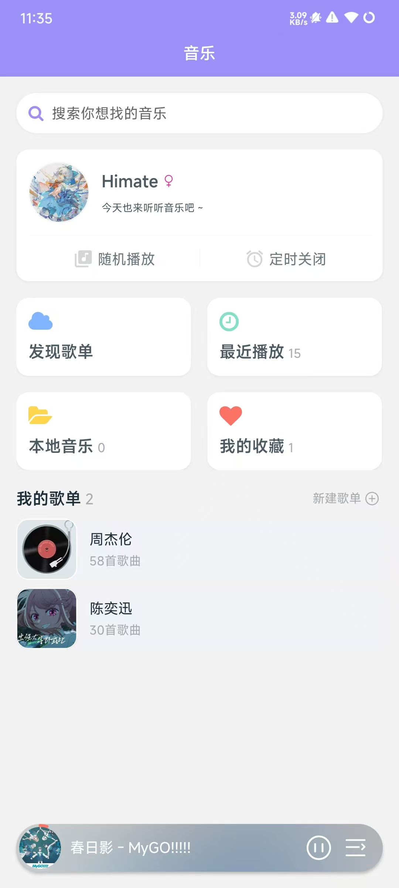
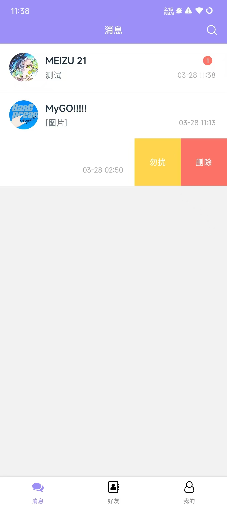
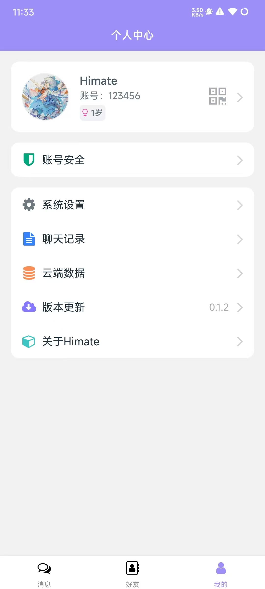
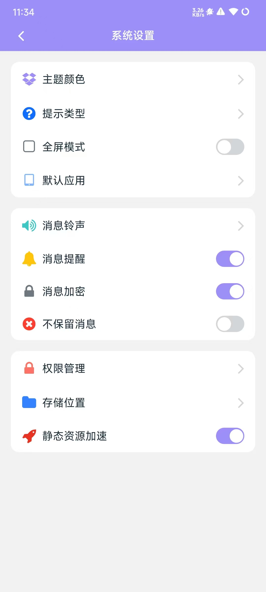

# Himate

### 简介

使用react native 0.75.5 开发的一款轻量的聊天和音乐播放器软件。

如何使用react native：https://reactnative.dev/

### 项目截图

      

      


### 平台适配

已适配Android，ios端

已知问题：ios不能播放.ogg格式音频，同时安卓无法播放ios默认的.m4a格式音频，ios部分UI有压缩。


### 开始

#### 项目环境

- nodejs > 18
- android端  java JDK17  android SDK 34
- ios端  Homebrew  ruby  CocoaPods

详见https://reactnative.dev/docs/0.75/set-up-your-environment

#### 运行项目

配置项目环境：项目目录.env文件

```
1
BASE_URL=你的服务地址
STATIC_URL=你的静态资源服务地址
SOCKET_URL=你的socket服务地址
FAST_STATIC_URL=你的静态资源服务地址
MSG_SECRET=你的加密消息秘钥

2
COULD_URL=获取所有服务接口
COULD_SECRE=获取所有服务的秘钥（如有）
```

选择一种方式作为你的环境配置：

- 如果你的每个服务都是独立的 ，使用配置 1
- 如果你使用一个的接口统一的获取你的所有服务，使用配置 2


若使用 配置 2 需要保证 COULD_URL 接口返回配置1的json数据

```json
{
   BASE_URL:你的服务地址
   STATIC_URL:你的静态资源服务地址
   SOCKET_URL:你的socket服务地址
   FAST_STATIC_URL:你的静态资源服务地址
   MSG_SECRET=你的加密消息秘钥
}
```

**注意**

.env文件主要用于作为配置示例，不建议直接配置.env文件作为您的项目环境，建议新建如.env.local这样的多个.env文件进行多环境配置，若配置不生效可尝试使用其它命名，同时注意添加到.gitignore，以免造成隐私泄露。

然后使用例如以下命令启动Metro，或自行配置启动命令

```
yarn start:dev
```

安装项目依赖

```
yarn
```

##### android端

启动安卓模拟器后或连接真机后使用以下命令进行编译

```
yarn android
```

如果使用Android14运行先进行如下修改

```java
./node_modules/react-native-musicontrol/android/java/com/tanguyantoine/react/MusicControlModule.java:204
原代码：context.registerReceiver(receiver, filter);
修改为：context.registerReceiver(receiver, filter, Context.RECEIVER_EXPORTED);

./node_modules/rn-fetch-blob/android/src/main/android/java/com/RNFetchBlob/RNFetchBlobReq.java:199
原代码：appCtx.registerReceiver(this, new IntentFilter(DownloadManager.ACTION_DOWNLOAD_COMPLETE))
修改为：if (Build.VERSION.SDK_INT >= 34 && appCtx.getApplicationInfo().targetSdkVersion >= 34) {
                    appCtx.registerReceiver(this, new IntentFilter(DownloadManager.ACTION_DOWNLOAD_COMPLETE),
                    Context.RECEIVER_EXPORTED);
                } else {
                    appCtx.registerReceiver(this, new IntentFilter(DownloadManager.ACTION_DOWNLOAD_COMPLETE));
                }
```

##### ios端

进入 项目目录/ios 文件夹下使用以下命令安装项目依赖

```
pod install
```

启动ios模拟器后或连接真机后使用以下命令进行编译

```
yarn ios
```

推荐使用Xcode打开/ios/himate.xcworkspace文件夹，并使用Xcode进行编译

#### 构建安装包

##### android端

```
cd android
```

debug（测试）版本

```
./gradlew assembleDebug
```

release（正式）版本

1. 使用java生成你自己的签名证书(.keystore)
2. 将.keystore文件放到 项目目录/android/app 文件夹下
3. 配置 项目目录/android/gradle.properties 文件的以下字段

```
RELEASE_STORE_FILE=您的keystore
RELEASE_KEY_ALIAS=
RELEASE_STORE_PASSWORD=
RELEASE_KEY_PASSWORD=
```

再执行

```
./gradlew assembleRelease
```
构建完成的安装包位于：项目目录\android\app\build\outputs\apk\release、

其它详见https://reactnative.dev/docs/0.75/signed-apk-android

##### ios端

使用xcode 设备选择Any ios Device (arm64) 打开Product ---> Archive 进行构建，前提是你拥有Provisioning Profile描述文件。

其它详见https://reactnative.dev/docs/0.75/publishing-to-app-store


### 优化

1，升级react-native-gifted-chat组件到2.8.0后，新增相对时间计算，但不太符合国内使用习惯可进行如下优化

```js
./node_modules/react-native-gifted-chat/lib/Constant.js:10/11

export const DATE_FORMAT = 'MM/DD HH:mm';
export const TIME_FORMAT = 'HH:mm';
```

```js
./node_modules/react-native-gifted-chat/lib/Day/index.js:20

const _date = dayjs(createdAt).locale(getLocale());
        if (!now.isSame(date, 'year'))
            return _date.format('YYYY MM/DD HH:mm');
        if (now.diff(date, 'days') < 1)
            return _date.calendar(now, {
                sameDay: '[今天] HH:mm',
                ...dateFormatCalendar,
            });  
        return _date.format(dateFormat);
```


2，解决使用react-native-audio-recorder-player组件播放音乐时，在网络延迟时导致的卡顿问题

```kotlin
./node_modules/react-native-audio-recorder-player/android/java/com/dooboolab.audiorecorderplayer/RNAudioRecorderPlayerModule.kt:311

// 使用prepareAsync()替代prepare()
            mediaPlayer!!.setOnErrorListener { mp, what, extra ->
                Log.e(tag, "MediaPlayer error occurred. what: $what, extra: $extra")
                promise.reject("startPlay", "MediaPlayer error occurred. what: $what, extra: $extra")
                true
            }
        
            mediaPlayer!!.prepareAsync()

324       Log.e(tag, "startPlay() null exception")
          + promise.reject("startPlay", "Null pointer exception occurred")


```


### 其它

后端服务：https://gitee.com/zyz1720/himate_nest_sever

后台管理：https://gitee.com/zyz1720/himate_vue_backend

项目演示：https://www.bilibili.com/video/BV1gBcVeEErs